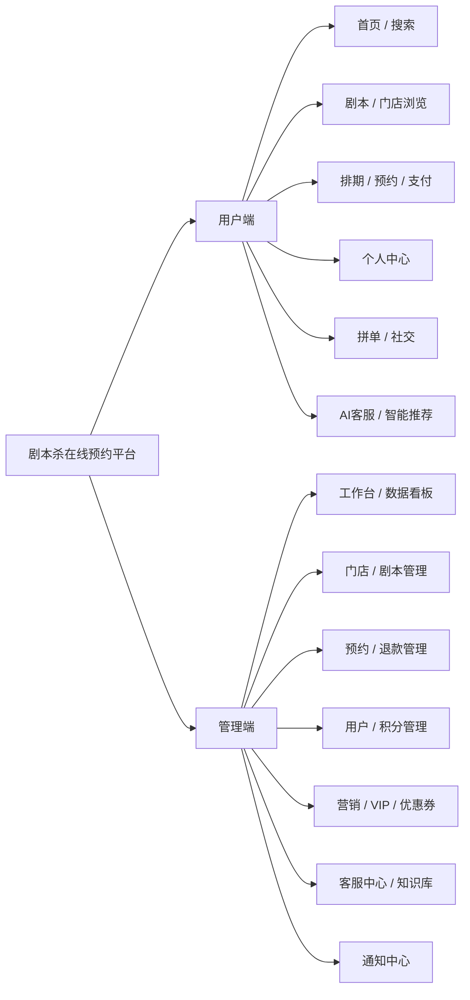

# 功能模块图（论文用）

## 一、用户端功能模块图

```mermaid
graph TD
    A[用户端] --> B[首页]
    A --> C[剧本模块]
    A --> D[门店模块]
    A --> E[预约模块]
    A --> F[个人中心]
    A --> G[互动模块]
    A --> H[AI功能]

    B --> B1[推荐展示]
    B --> B2[全局搜索]
    B --> B3[资讯攻略]

    C --> C1[剧本大厅]
    C --> C2[剧本详情]
    C --> C3[智能推荐]

    D --> D1[门店列表]
    D --> D2[门店详情]
    D --> D3[排期大厅]

    E --> E1[选择场次]
    E --> E2[确认预约]
    E --> E3[在线支付]
    E --> E4[预约详情]
    E --> E5[申请退款]
    E --> E6[评价订单]

    F --> F1[个人资料]
    F --> F2[我的预约]
    F --> F3[我的收藏]
    F --> F4[我的优惠券]
    F --> F5[我的积分]
    F --> F6[浏览历史]
    F --> F7[消息通知]
    F --> F8[VIP会员]
    F --> F9[账号设置]

    G --> G1[拼单大厅]
    G --> G2[发起拼单]
    G --> G3[我的留言]

    H --> H1[AI客服]
    H --> H2[智能推荐]
```

---

## 二、管理端功能模块图

```mermaid
graph TD
    A[管理端] --> B[工作台]
    A --> C[门店管理]
    A --> D[剧本管理]
    A --> E[预约管理]
    A --> F[用户管理]
    A --> G[营销管理]
    A --> H[客服中心]
    A --> I[通知中心]

    B --> B1[数据看板]
    B --> B2[经营看板]
    B --> B3[营收日报]

    C --> C1[门店列表]
    C --> C2[门店统计]
    C --> C3[房间管理]
    C --> C4[DM管理]
    C --> C5[员工管理]
    C --> C6[评价管理]

    D --> D1[剧本列表]
    D --> D2[剧本分类]
    D --> D3[角色管理]
    D --> D4[排期管理]
    D --> D5[剧本评价]

    E --> E1[预约列表]
    E --> E2[新建预约]
    E --> E3[退款管理]

    F --> F1[用户列表]
    F --> F2[积分管理]
    F --> F3[地址管理]

    G --> G1[优惠券管理]
    G --> G2[用户优惠券]
    G --> G3[VIP套餐]

    H --> H1[在线客服]
    H --> H2[知识库管理]
    H --> H3[留言管理]

    I --> I1[系统通知]
```

---

## 三、合并版（用户端 + 管理端总览）

```mermaid
graph LR
    ROOT[剧本杀在线预约平台] --> USER[用户端]
    ROOT --> ADMIN[管理端]

    USER --> U1[首页 / 搜索]
    USER --> U2[剧本 / 门店浏览]
    USER --> U3[排期 / 预约 / 支付]
    USER --> U4[个人中心]
    USER --> U5[拼单 / 社交]
    USER --> U6[AI客服 / 智能推荐]

    ADMIN --> A1[工作台 / 数据看板]
    ADMIN --> A2[门店 / 剧本管理]
    ADMIN --> A3[预约 / 退款管理]
    ADMIN --> A4[用户 / 积分管理]
    ADMIN --> A5[营销 / VIP / 优惠券]
    ADMIN --> A6[客服中心 / 知识库]
    ADMIN --> A7[通知中心]
```
